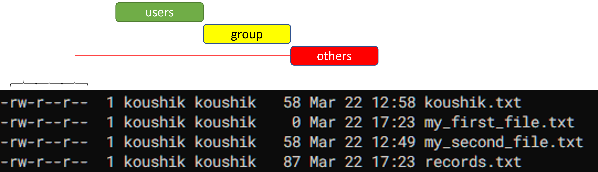

In our previous [post](https://koushikkhan.github.io/posts/2023-03-22-bash-commands-for-cloud-1/), we have seen examples to become confident enough for getting a grip on linux commands. This is the time now to jump into more advanced topics. Let's go.

# Working with Permissions

The word 'Permission' typically stands for putting a guard wall while accessing any resource. For example, someone may or may not has permission to access a specific folder (directory) in a computer. It all depend on roles and responsibilities of the users.

In linux, permission to access files and directories is categorized into three levels, these are **user**, **group** and **others**. Let's see what do they mean when they are in action,

+ **user**: this category refers to the owner of the file or directory. Being the owner, user has the highest level of access to the file or directory and an user can modify or delete it.

+ **group**: this category refers to a group of users having the same level of access to a file or directory. If a group is assigned a specific permission, then all users within the group are also having same permission.

+ **others**: this category refers to all other users who are not the owner or part of the group assigned to the file or directory. These users are having lowest level of access to the file or directory.

There are three specific access types for all users - *read*, *write* and *execute* and these are denoted by *r*, *w* and *x* respectively. 

Therefore, for each file, access level is represented by a sequence of nine characters just like below:

  

Now, let's consider one file e.g. *records.txt*. For this file,

+ the user 'koushik' is owner of the file as mentioned and 'koushik' has both read and write permission but not the execute permission
+ the group has only read permission
+ others also have read access.

*Don't consider the very first character as part of access level string as it just denotes whether the corresponding entity is a file or directory, for file it is shown as '-' (hyphen) and for directory it is shown as 'd'*
