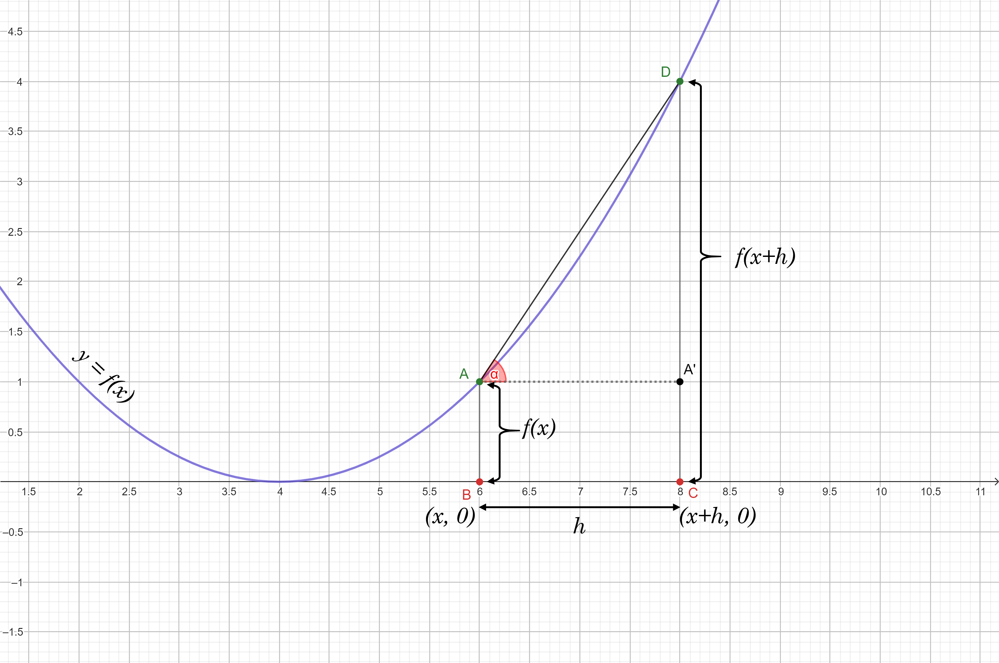

# Introduction

In our high school mathematics, we have learnt *Differential Calculus*, which has introduced the term 'differentiation' or 'derivative' of a function with respect to a variable. This derivative has played a significant role in today's deep learning algorithms. 

We all are familiar with the concept of derivative and hopefully, have solved a lot of exercises. I this post, I will revisit the core idea of computing derivativea and also try to develop the idea that is being used behind the learning process of a neural network.

# Derivative of a function

Let us take a simple function $f(.)$ that depends on the input $x$. The derivative of $f(x)$ w.r.t $x$ is defined as follows:

$$
\frac{df}{dx} = \lim_{h \to 0} \frac{f(x+h) - f(x)}{(x+h) - x}
$$

The figure below, will make the definition easier to understand.

As you can see, because of a change in $x$ (by an amount $h$), there is a change on the output. The output has become $f(x+h)$ from $f(x)$. 

Now, as per the definition, the ratio $\frac{f(x+h) - f(x)}{(x+h) - x}$ is nothing but the *tangent* of the angle $\angle{DAA'} = \alpha$ of the triangle $\triangle{DAA'}$.

Now, let us think about the interpretation of putting a limit on $h$. Obviously, the limiting term is indicating a very small change on the input $x$, not only that, when $h$ is very close to zero which is in turn the case when the points $(x, 0)$ and $(x+h, 0)$ are very close to each other, then the line segment $\overline{AD}$ will eventually become the tangent of the curve at the point $(x, 0)$.

Therefore, the definition of derivative of a function, geometrically refers to a tangent of the curve $y = f(x)$ at the point $x$.

The tangent of a curve at some point $x$ is important as it gives us an idea about the nature of the curve locally. Geometrically, if the tangent line makes an acute angle with the $X-Axis$ (which is the case here), then it denotes a positive change on the output and when it makes an obtuse angle, it denotes a negative change on the output. If the tangent line horizontal to the $X-Axis$, then there is no change on the output.

Similar information can also be obtained by evaluating the expression of derivative at some point $x$. If the limiting value of the ratio is positive, then obviously, there is a positive change on the output otherwise the change is negative and having a value as zero indicates there is no change on the output.

Note that, till now, we have discussed only on a scalar valued function with a scalar valued input. We will now try to get some ideas when either of the function and input or both of them are vector valued. 

## Derivative of a scalar valued function w.r.t a vector valued input

Let us consider a scalar valued function $f$ based on a vector valued input $\vec{x}$ with dimension $k$. 

In this case, the function can be any simple function like $sin(.)$ or $log(.)$ depending on the requirements and for each component of $\vec{x}$, the function has to be evaluated. Hence, the output is also vector valued.

Consider the following example:

We have the input $\vec{x} = \left(x_1,\ldots,x_k\right)$ and the function is $f(u) = log(u)$. Hence the output vector is $\vec{y} = f(\vec{x})$

