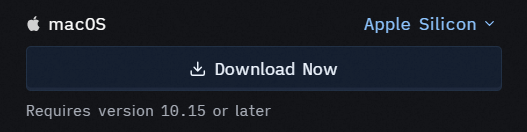
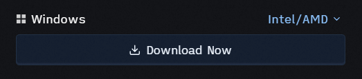

<center>

<figcaption> Zed for Data Science Development
  </figcaption>
</center>


# Why Zed?

For years, VS Code has been the undisputed heavyweight champ of data science text editors. But let’s face it: it has grown increasingly heavy, often demanding a tax on your RAM and battery life just to keep up with dozens of extensions.

Enter [Zed](https://zed.dev/), a blazing-fast, Rust-powered code editor built by the creators of Atom and Tree-sitter. Following its massive 1.0 milestone release, Zed has matured into a production-ready, ultra-lean powerhouse. It leverages the GPU to render pixels at lightning speed and native multi-model AI workflows right out of the box.

If you are a data scientist tired of editor lag when analyzing massive log files or waiting for heavy plugins to load, this guide will walk you through transitioning your data science development workflow over to Zed.

While VS Code uses Electron (essentially running an instance of Chromium for the UI), Zed is built from scratch in Rust and utilizes your GPU for rendering. The practical differences for data science workflows are substantial:

- **Memory Efficiency:** Zed starts instantly and takes up a fraction of the RAM that VS Code consumes, leaving precious memory free for training local models or handling massive in-memory data frames.

- **Zero Text Lag:** Whether scrolling through a 100,000-row CSV file or a giant Python script, Zed maintains a solid frame rate with zero input delay.

- **First-Class Collaborative Coding:** Zed features built-in Conflict-Free Replicated Data Types (CRDTs) for real-time multiplayer pair programming, which is ideal for joint modeling sessions or notebook reviews.

- **Integrated Agentic AI:** Rather than relying on clunky third-party extensions, Zed includes its own Agent Client Protocol (ACP), allowing you to interact with advanced models (like Claude and GPT variants) seamlessly from a side panel.

# Installing Zed Across Platforms

Getting Zed up and running takes seconds, regardless of your operating system.

## Linux

Linux users can use the standard installation script that automatically fetches the binary and handles path configurations:

```bash
curl -f https://zed.dev/install.sh | sh
```

## macOS

The easiest route is using [Homebrew](https://formulae.brew.sh/cask/zed), 

```bash
brew install --cask zed
```

or [downloading](https://zed.dev/download) the app bundle directly from the website for supported CPU architectures:

{ width=60% }

## Windows

With full stable native support, Windows users can install Zed using [Windows Package Manager](https://learn.microsoft.com/en-us/windows/package-manager/winget/) - WinGet

```powershell
winget install Zed.Zed
```

or the executable can be [downloaded](https://zed.dev/download) for standard CPU architectures,

{ width=60% }


# Mastering the Configuration Trinity

Unlike traditional IDEs with sprawling graphical configuration menus, Zed embraces a minimalist, text-first philosophy. Your entire environment is managed using three JSONC (JSON with Comments) files.

- `settings.json`: Governs global UI preferences, telemetry, font sizes, specific theme selections, Language Server Protocol (LSP) behaviors and many more.

- `tasks.json`: Defines custom external commands to run - such as executing an entire pipeline file, running a shell command, or compiling scripts.

- `keymap.json`: Customizes keyboard shortcuts, making it easy to map VS Code or Vim-style hotkeys.

## Best Practice: Global vs. Local Configuration

Understanding the boundary between global and local files keeps your workflows reproducible and predictable.

- **Global Files:** These reside in your user profile. Use them for your baseline aesthetics, default fonts, UI layouts, and primary language settings.

- **Local Files:** These live directly in your project root i.e. `.zed/settings.json` or `.zed/tasks.json`. Always use local files to lock down project-specific requirements, such as enforcing formatting style constraints, pointing to the exact virtual environment directory, or registering custom script execution tasks.

:::{.callout-tip}
**Data Science Tip:** Never commit your personal API keys or local file paths into a repository's local .zed/ folder if you plan on sharing it with a team. Keep those properties inside your global configuration.
:::

# Useful Plugins for Data Science Use Cases

Zed includes a growing marketplace of extensions accessible via the command palette (`Ctrl+Shift+P` or `Cmd+Shift+P` `-> Extensions: Open`). Here are the essential plugins to pull down:

- **Python & Ruff:** Provides lightning-fast formatting, linting, and sorting of import structures.

- **R:** Brings full syntax parsing and auto-completion support to .R scripts.

- **Quarto:** Installs the grammar support required for running integrated literate programming routines.

- **LaTeX:** Crucial for writing academic write-ups or technical documents and rendering source code documentations that needs mathematical understanding. Zed has an excellent support for using LaTeX using the [zed-latex](https://github.com/rzukic/zed-latex/wiki) plugin. 

# Configuring Zed for Various Tools

Let’s look at how to structure your configurations to turn Zed into an ideal environment for data workflows.

## Git

Zed features built-in, native Git integration. It handles inline gutter markers, split diff views, and active branch changes out of the box without any extra extensions. You can quickly see changes by opening the Project Panel and checking modified files.

## Python

To ensure Zed smoothly reads your project's virtual environment and utilizes Pyright and Ruff for linting and formatting on save, add this to your local .zed/settings.json:

## R

Zed handles R syntax natively through its integrated tree-sitter integration. Ensure you have the languageserver package installed in your R environment (install.packages("languageserver")). Zed will spin up the server automatically when you open an .R file, providing syntax linting and function completions.

## LaTeX

When draft-writing documentation or research summaries using the LaTeX extension, Zed ensures clear structural highlight mappings. It also features clean mathematical support embedded natively in standard Markdown files:

The `settings`, `tasks` and the `keymap` guide on using Zed for LaTeX using the Rust-based [Tectonic](https://tectonic-typesetting.github.io/book/latest/introduction/index.html) compiler.

**Global `settings.json`**
```json
{
  "languages": {
    "LaTeX": {
      "language_servers": ["texlab"],
      "soft_wrap": "editor_width",
      "formatter": {
        "external": {
          "command": "latexindent",
          "arguments": ["--modifylinebreaks"],
        },
      },
      "format_on_save": "on",
    },
  },
  "lsp": {
    "texlab": {
      "settings": {
        "texlab": {
          "build": {
            "executable": "tectonic",
            "args": ["-X", "build", "--keep-logs", "--keep-intermediates"],
            "onSave": true,
            "forwardSearchAfter": true,
          },
        },
      },
    },
  }
}
```

**Local `tasks.json`**
```json
[
  {
    "label": "LaTeX: Forward Search (Skim)",
    "command": "/Applications/Skim.app/Contents/SharedSupport/displayline -r -z -b $ZED_ROW $ZED_WORKTREE_ROOT/build/index/index.pdf $ZED_FILE",
    "allow_concurrent_runs": false,
    "reveal": "never",
    "hide": "always",
  },
  {
    "label": "LaTeX: Forward Search (SumatraPDF)",
    "command": "cmd.exe",
    "args": [
      "/c",
      "start",
      "\"\"",
      "C:\\Users\\<User.Name>\\AppData\\Local\\SumatraPDF\\SumatraPDF.exe",
      "-reuse-instance",
      "${ZED_WORKTREE_ROOT}\\build\\index\\index.pdf",
      "-forward-search",
      "${ZED_FILE}",
      "${ZED_ROW}",
    ],
    "reveal": "never",
    "use_new_terminal": false,
    "allow_concurrent_runs": true,
  },
]
```

## Quarto

Using the Quarto plugin allows you to combine your prose with code segments. To run your computations and see real-time changes, open the file in Zed, hit Ctrl+~ (or Cmd+J) to drop down the integrated terminal, and run:

```bash
quarto preview my_analysis.qmd
```

Your browser will instantly launch a live-reloading pane displaying your data visualizations and computed data metrics alongside your markdown documentation.


# Zed as a Swiss Army Knife

Data science rarely happens purely on a local machine. Often, you need to interface with remote clusters, run quick scripts, or write ad-hoc queries. Zed serves as a lightweight Swiss Army knife across these layers:

- **Seamless Remote Workflows:** With built-in SSH and native WSL support, you can link directly to a remote compute instance or GPU rig, editing files on the server with the exact same speed as local files.

- **The Terminal-Centric Approach:** Because Zed avoids massive side-bars and heavy visual menus, it naturally funnels you toward using its ultra-fast integrated terminal. You can run training scripts, spin up Docker containers, or manage data streams without needing to leave the keyboard.

- **The Minimalist Scratchpad:** Even if you still rely on heavy browser-based tools for certain exploratory notebooks, Zed excels as a zero-overhead scratchpad to instantly clean files, edit configuration .toml or YAML paths, and draft project scripts without any overhead.
